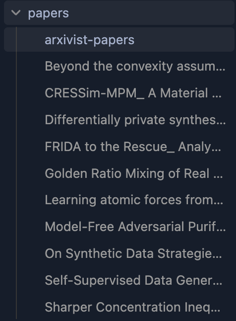
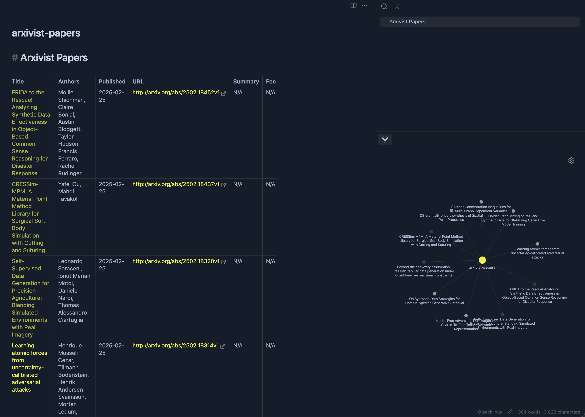
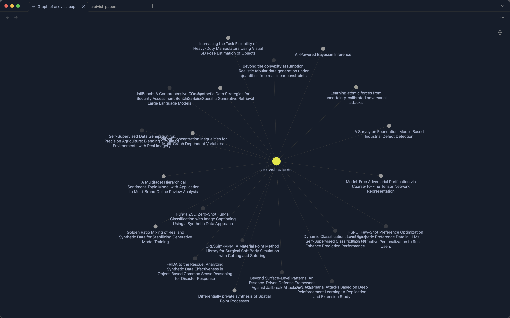
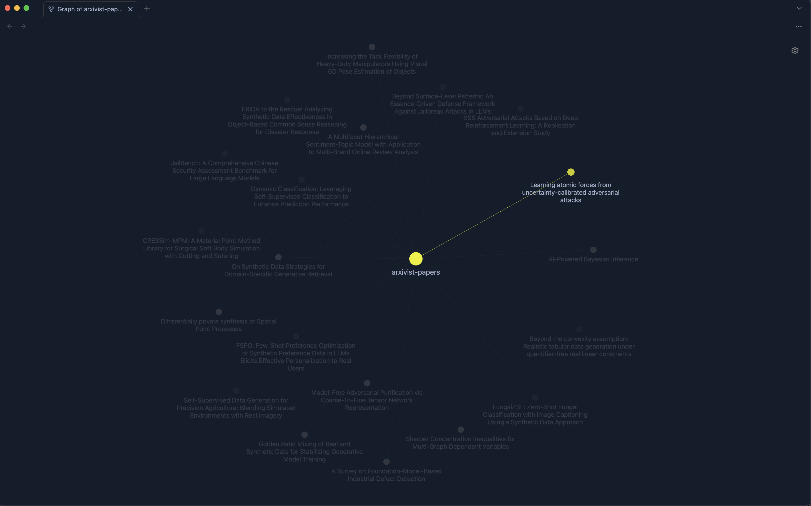
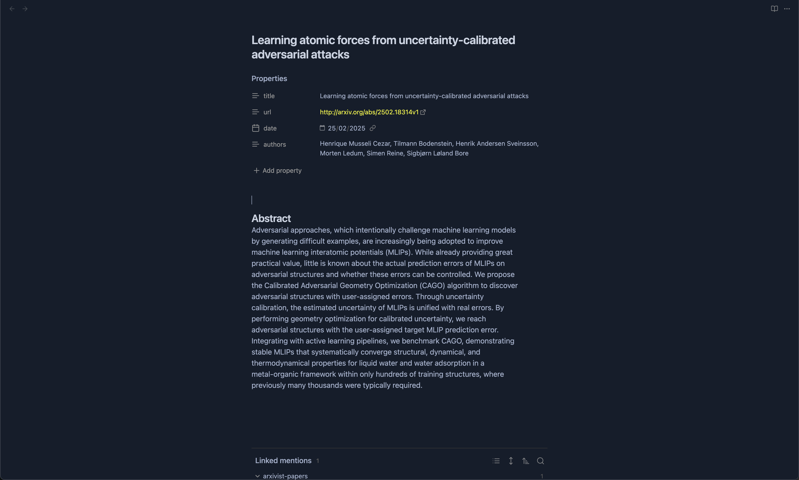

# Arxivist

Arxivist is a fork from [Paperstack](https://github.com/dreadnode/paperstack) with a focus on using Obsidian as a primary output format.


Arxivist uses ArXiv and Semantic Scholar (relational) to sync academic paper information into a Notion DB. It also has some lightweight uses of OpenAI models for summarization and categorization. It was built for gathering machine learning and security related papers, but could be adapted easily to any other subject (`ARXIV_SEARCH`/`--arxiv-search-query`). It's deplyoment is focused on Github actions, but can be executed on the command line directly. It can also detect partial entries (ArXiv link or title) in the Notion DB and fill in the remaining information.

The Notion DB requires a semi-fixed structure as a function of the syncing logic (`notion_utils.py`), and you're free to add columns and custom syncing behavior as needed. Here is the mininmum database layout the tool currently expects:

```
Title [Title]
Summary [Text]
Focus [Select]
URL [URL]
Authors [Mutli-select]
Published [Date]
Explored [Checkbox]
```

The majority of command line arguments can be passed via environment variables as expected by the workflows.

```
NOTION_TOKEN
NOTION_DATABASE_ID
OPENAI_API_TOKEN
```

# Usage

```
python arxivist.py --output-obsidian <path>
```

## Command Line Arguments

The following command line arguments can be used when running the Arxivist script:

- `--output-csv <path>`:
  - **Type**: `str`
  - **Default**: `papers.csv`
  - **Description**: Specifies the path to the output CSV file where the paper information will be saved.

- `--openai-token <token>`:
  - **Type**: `str`
  - **Default**: `None`
  - **Description**: Optional OpenAI token for using OpenAI's API for summarization and focus label generation.

- `--arxiv-search-query <query>`:
  - **Type**: `str`
  - **Default**: A predefined search query for arXiv papers related to machine learning and security.
  - **Description**: The search query used to find relevant papers on arXiv. You can customize this to search for different topics.

- `--search-arxiv`:
  - **Type**: `boolean`
  - **Default**: `False`
  - **Description**: If specified, the script will search arXiv for new papers based on the provided search query.

- `--search-semantic-scholar`:
  - **Type**: `boolean`
  - **Default**: `False`
  - **Description**: If specified, the script will search Semantic Scholar for related papers to the ones already collected.

- `--output-obsidian <path>`:
  - **Type**: `str`
  - **Default**: `papers.md`
  - **Description**: Specifies the path to the output folder for writing papers in Obsidian markdown format.

  # Output
  After running the script, you will have a `arxivist-papers.md` file in the output folder containing a table of the papers.

  You can send the output into your Obsidian vault and use it as a reference for your papers.

  

  Files in Obsidian:
  

  Full Graph in Obsidian:
  

  Graph Paper Selection in Obsidian:
  

  Paper note in Obsidian:
  

Thanks to [Dreadnode](https://dreadnode.io/) for the initial implementation of  [Paperstack](https://github.com/dreadnode/paperstack)!!

# Future Work

- Add a local LLM for summarization and focus label generation.
- Add a key points to send it to a srs (spaced repetition system) service.
- Add a service for easier user usage.
